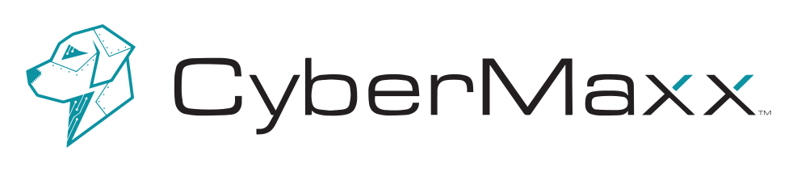

 

  
   &#8287;&#8287;&#8287;
   <a href="https://www.youtube.com/channel/UCWIla0Ree5BZfGmwOZ2VO5Q">

  

 
  
<h2>Projects Sponsored By CyberMaxx</h2>

    

     
     
  </a>
   

  
<h2>CyberMaxx Repos</h2>

 

   
    </a>
   

